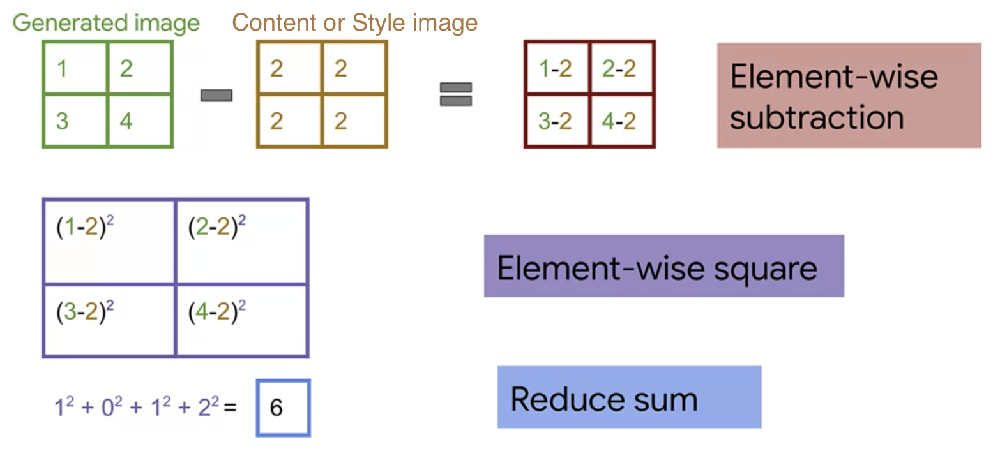

# Coursera Generative Deep Learning

Neural Style Transfer, Variational AutoEncoders, and GANs templates

- https://www.coursera.org/learn/generative-deep-learning-with-tensorflow
- https://github.com/https-deeplearning-ai/tensorflow-3-public/tree/main/Course%204%20-%20Generative%20Deep%20Learning

### Variational AutoEncoders

- The main benefit of a Variational AutoEncoder is to learn smooth latent state representations of the input data.
- A Variational AutoEncoder's decoder is what is used in inference.
- The training of the decoder is about learning how to harness the random matrix.
- There are the "mean" part and "standard deviation" part (instead of just the "mean" part) because we want the encoder return a distribution over the latent space instead of a single point.
- The encoder is for creating a consistent and meaningful mapping between random matrix values and images.

 

From: https://www.jeremyjordan.me/variational-autoencoders/

 

From: https://towardsdatascience.com/understanding-variational-autoencoders-vaes-f70510919f73

- The loss function that is minimised when training a VAE is composed of a “reconstruction term” (on the final layer), that tends to make the encoding-decoding scheme as performant as possible, and a “regularisation term” (on the latent layer), that tends to regularise the organisation of the latent space by making the distributions returned by the encoder close to a standard normal distribution. 
- The model is then trained as follows:
  - first, the input is encoded as distribution over the latent space
  - second, a point from the latent space is sampled from that distribution
  - third, the sampled point is decoded and the reconstruction error can be computed
  - finally, the reconstruction error is backpropagated through the network
- The reason why an input is encoded as a distribution with some variance instead of a single point is that it makes possible to express very naturally the latent space regularisation: the distributions returned by the encoder are enforced to be close to a standard normal distribution.

 

From: https://towardsdatascience.com/intuitively-understanding-variational-autoencoders-1bfe67eb5daf

- The fundamental problem with autoencoders, for generation, is that the latent space they convert their inputs to and where their encoded vectors lie, may not be continuous, or allow easy interpolation.
- If the space has discontinuities (eg. gaps between clusters) and you sample/generate a variation from there, the decoder will simply generate an unrealistic output, because the decoder has no idea how to deal with that region of the latent space. During training, it never saw encoded vectors coming from that region of latent space.
- A Variational AutoEncoder's latent space is continuous, allowing easy random sampling and interpolation.
- A VAE's decoder learns that not only is a single point in latent space referring to a sample of that class, but all nearby points refer to the same as well, as the decoder is exposed to a range of variations of the encoding of the same input during training.
- Kullback–Leibler divergence is for forcing distributions of different classes to be as close as possible to each other while still being distinct, allowing smooth interpolation, and enabling the construction of new samples.

 

### GAN

- When train the Generator with the Discriminator frozen, the labels used are all 1's. The reason for having all 1's is that, if a fake image is classified by the Discriminator as fake (close to 0), then there will be a large loss, which is desired.
- A list of GAN tricks: https://github.com/soumith/ganhacks

 

### Neural Style Transfer

CNN is not updated, but the input image is updated instead:

 

Calculating Content Loss or Style Loss:

